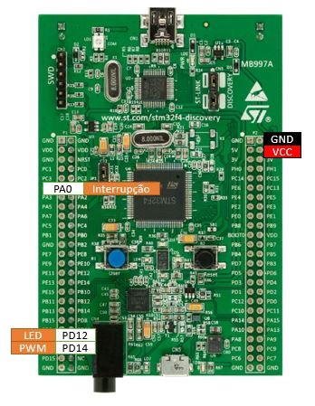

# Manipulador com servo motor

### Proposta 
O projeto tem a proposta de utilizar dois servos motores, de forma a ter-se uma garra,
cuja abertura é controlada por um botão que, a cada interrupção aumenta o valor do ângulo 
do servo até um certo ponto, no qual volta ao início.
Sua utilidade é pegar objetos e poderia ser parte de um projeto maior, o qual envolveria o
deslocamento da garra. Isso facilitaria pessoas dentro de casa com dificuldade de locomoção
a conseguirem pegar objetos distantes.
O projeto foi implementado para apenas um servo, porém o segundo servo seria adicionado de maneira
análoga (simétrica).

### Periféricos 
A elaboração do projeto será feita com uma STM32F407Discovery. Será utilizado
um servos motor com comunicação PWM e um botão como entrada GPIO, de acordo com 
o ilustrado na figura 1.

Figura 1: Diagrama de blocos da eletrônica

### Pinagem

### Fluxograma do firmware

### Funções e variáveis
### Variáveis
- int period Periodo do timer
- int j Determina o ângulo do servo a cada interrupção

### Funções
- void InitializeTimer(int period) Inicializa o timer
- void PWM(int duty) Inicializa PWM
- void InitializeLEDs() Inicializa LEDs
- void ConfigInt() Configura interrupção
- extern "C" void EXTI0_IRQHandler(void) Executa a interrupção

### Referências
1. Proposta de projeto dada pelo professor da cadeira de Microcontroladores (2018),
Cap. Renault.
2. [Manual de Referência STM32F4](http://www.st.com/content/ccc/resource/technical/document/reference_manual/3d/6d/5a/66/b4/99/40/d4/DM00031020.pdf/files/DM00031020.pdf/jcr:content/translations/en.DM00031020.pdf)
3. [Projeto da Aluna Jéssica Aires, cadeira de Microcontroladores 2017, Instituto Militar de Engenharia.](https://gitlab.luizrenault.com/microcontroladores-2017/jessica/tree/master)
